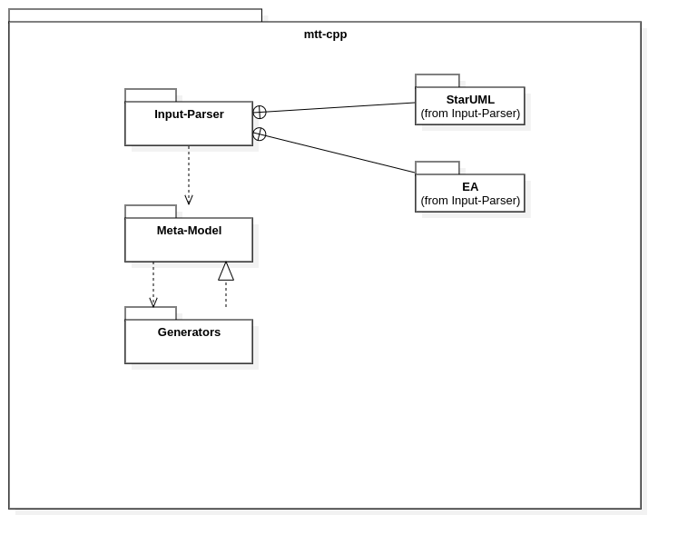

# Introduction

The architecture should reflect some major requirements.

 * Usable with various UML modelers through different input-parsers.
 * Generation of almost any text content from the models
 * Configurable in some parts.

## Overall Structure

The overall structure is simple.

The generators are deriving the meta model classes and the meta model is used to instantiate them.
This way the parser does not know the implementation details of the generator classes.

The realization link is somewhat misleading. In fact the generator classes realizing some things from the meta model
and the meta model classes can be interpreted as interfaces, but it does not match perfectly.

