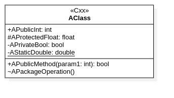
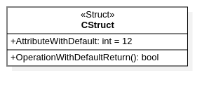

# Users Manual

This manual is intended for those people who only want to use the generator.
It explains the things that are related to code-generation from UML models but is no UML modeling handbook.

You will find some areas where I describe things that are not directly related to the generator. There I only can talk
about my own experiences and believe in certain things. So don't be offended by that. Please.

Maybe others can fetch some ideas out of it, to implement other approaches.

## Philosophy of the generator

It's always helpful to understand the philosophy of a software first before using it. Cause sometime you have a 
complete different idea how things should work.

### Why creating only skeletons?
It may sound a good idea to create all code from the model. This would possible with sequences and activities. I thought
of it many times and even started with some implementation that still lingers in the code base.

But in the end the effort for the creation of the necessary diagrams, that must be detailed enough to accomplish the goal, 
is far to high.

Another problem arises in an professional development company. There you would need to either qualify the tool, so proof 
that the generated code is always correct, even if the generator may crash inbetween, that it is possible to identify that and
react to it.

For this qualification process you would need to have all code covered by requirements, and have tests in place to proof that
these requirements are met. Everything around all that effort needs to be done after any change to the software. So a really 
complete automated environment.

Or you do a review of the generated code afterwards. 

So it makes far more sense to create only the skeletons and do the implementation manually and review it afterwards.

### Why is it a standalone solution?

Make it an integral part of any UML modeler, there are not many out there that I would use in some sort of professional 
environment, would require the support of different language bindings. Enterprise Architect has a .NET library to access
some functions. IBM Rhapsody has a Java Library. And other may use some different language.

As all these modelers conform in one way or the other on the UML meta model, it is far more easy to create these input plugins,
that deal with the model storage.

As a standalone application it can even been run in a CI/CD pipeline. So it's more a thing of flexibility.

### How does the generator identify the parts to generate?

Mainly it is done through stereotypes that can be attached to the model elements. If there are dependencies to not stereotyped
model elements it is determined from the context, like for Interface Classes. They may be used for C++ and Java and if I am 
right are stored differently in Enterprise Architect and StarUML. One attaching a stereotype to a class the other has an 
interface type in its internal model.

The java generator is not part of the code base. But I know that a friend of mine created Java generator classes and it worked.

## The manual
Here we start with the manual. All examples are based on a StarUML model. As UML:registered: is somewhat a standard you will find similar
behaviour for the Enterprise Architect as well.

As I do not know better I will start to explain things along the model elements, classes, packages, and the like.

### Command line parameters
There are only a few simple parameters that can be passed on the commandline.
Over time there where so many switches introduced that the use of a configuration file was the better approach.
The command line parameters can appear in any position on the command line.

mtt-cpp <input-file> <options>

The generator will deduce the input parser from the filename extension.
Options are preceded with a dash. Values to the options can be directly attached or separated by a space.

* -c <config-file-name> : Name of the configuration file.
* -d <directory-name> : All generated artifacts are generated starting in this directory.
* -v : Output of version information and copyright notice.
* -?
* -h : Both variations give a short help and exit.

### Configuration File
The configuration file is an XML formatted file.

### General approach
To generate files from a UML model you deal with two different ways to make things visible to the generator.

* Stereotypes
* Tagged Values

#### Stereotypes
These are as abstract as an UML model is. They help distinguish between variations of Model Elements. For example a Class.

In short: Classes are containers that can have attributes and/or methods. So if you have something that has attributes and/or methods,
it can be represented as class. But without further information this thing can not be distinguished between a class that 
should be coded, or a class that represents only some sort of meta model element, or is a task, or something completely different
that by accident has attributes and/or methods.

These are the place where stereotypes are used. They help distinguish, not only in the generator, between variations of model elements.

#### Tagged Values
Tagged values are simple name value pair that can be attached to a model element. They are often used to connect the abstract
world of the model to the real world.

These are extensively used with generator, because that's his purpose, transfer the abstract model into the real world.

### Packages
Packages are like directories in file system browsers. They structure the model and you can put any other model element
into packages if you see fit to it. They need not be aligned to your directory structure but will mostly reflect your
desired directory structure while generating the files.

The generator will look out for the following stereotypes attached to packages.

* library
* application
* wxapp
* extern or system
* subsystem
* module
* jscript
* php
* simulation or model
* httpifc

Even if have not attached a stereotype to any of your packages the generator will start create files if he identifies
model elements that he can create. But than they may be created in places where you did not expect it and no supporting
files, like makefiles are created.

#### library
The library stereotype is used for packages that assemble into a library. Add this point it is not determined if it is a static
or dynamic library. 

For this package a makefile will be created that creates both of the library types. All model elements below are incorporated 
in the library if they can be build with a C++ compiler. It's strict C/C++ related.

For the library package a directory is generated. If no tagged value "directory" is set the name of the package will be used.

##### Tagged Values

* directory     - subdirectory where all generated artifacts are stored into. If this is not set the name of the package is used.
* outputname    - the base name of the library files
* extrainclude  - List of include filenames, including the extension, that are used for all C/C++ files generated
* outputpath    - I do not know ;)
* namespace     - The namespace for the types/classes below the package
* CxxFlags      - Some additional compiler flags to use while building
* LibPath       - Some library search path on linking

#### application
The application stereotype is used for packages that assemble into an application. All model elements below this package 
are incorporated into an application/executable. For this package a makefile will be created. It's strict C/C++ related. 

##### Tagged Values
* directory - subdirectory where all generated artifacts are stored into.  If this is not set the name of the package is used.
* outputname - name of the application
* extrainclude  - List of include filenames, including the extension, that are used for all C/C++ files generated
* outputpath    - I do not know ;)
* namespace     - The namespace for the types/classes below the package
* CxxFlages - Some additional compiler flags to use while compiling
* LdFlags   - Some additional linker flags to use while linking
* LibPath       - Some library search path on linking
 
#### wxapp
A wxapp is used for WxWidgets application. It is an extension of the application type package but has some special 
parameters to the generated makefile that helps determine the parameters for building the app.

##### Tagged Values
Same as application.

#### extern/system
These packages are used for system libraries. This way its easier to incorporate framework libraries with their classes 
and types into the model. All classes defined in such a package are handled as they have a extern stereotype as well.
Simple Packages with a namespace tagged value can be used to manage namespaces below an extern package.

##### Tagged Value

It shares most of the library package tagged values.

#### simulation/model
The simulation/model package is a special package meant to be used in conjunction with the 
[simulation-core](https://github.com/tribad/simulation-core) it generates makefiles to create a special library package
that can than be loaded at runtime into the simulation-core.

##### Tagged Values
As the simulation/model is loaded as a library it uses the same tagged values as the library package plus some specials

* simulationname/modelname - It is used as the output name. If the tagged value outputname is set as well, it is overwritten with the simulationname/modelname
* AppCoreVersion - It is set on the UML-Model level and used in these simulation/model package for the makefiles.

### Classes

Classes can be used whenever you have to design something that has attributes and/or operations defined.
To distinguish between different specific meanings what this class represents, you have stereotypes to clarify what is holding these attributes and/or operations.

The generator will look out for the following stereotypes attached to packages.

C/C++ specific
* Cxx
* C
* Struct
* Union
* moduleclass

Auxiliary stereotypes
* Enumeration
* interface
* extern
* signal
* primitivetype
* dataType

Framework specific
* qt
* wxform

Alternate language support
* jscript
* php

Serializer specific
* json
* tlv
* protobuf

Application Core
* modelitem
* modelenum

Simulation Core
* simobject 
* simenumerator
* simstruct
* simmessage
* simsignal

Integrated WebServer
* htmlpage


#### Cxx 
The generator will create C++ class code fragments.
A simple example how it looks like. More possibilities are described later.



The header file generated
```
#pragma once
#ifndef ACLASS_INC
#define ACLASS_INC
//
//  type aliases
///
/// Demonstration of class member attributes and operations.
///
class AClass {
public:
    ///
    /// @brief Do something
    ///
    /// @param[] param1 An integer
    /// @return True or False?
    ///
    bool APublicMethod(const int param1) noexcept;
public:
    int           APublicInt;      // An Integer
protected:
    float         AProtectedFloat;
private:
    bool          APrivateBool;
    static double AStaticDouble;
};
//
//  These are the operations defined with package scope.
void APackageOperation() ;

#endif  // ACLASS_INC
```
The source file generated.
```
#include "AClass.h" // Needed default without path
// Optional
double AClass::AStaticDouble;
//
// This is like a C-Function and why the C-Code generation has been abandoned.
void APackageOperation() {
// User-Defined-Code:AAAAAAGb9ArYTRZRnK0=
// End-Of-UDC:AAAAAAGb9ArYTRZRnK0=
}

///
/// @brief Do something
///
/// @param[] param1 An integer
/// @return True or False?
bool AClass::APublicMethod(const int param1) noexcept {
    bool AReturnType;
// User-Defined-Code:AAAAAAGb73Hmqx1m4/k=
// End-Of-UDC:AAAAAAGb73Hmqx1m4/k=
    return  (AReturnType);
}
```

#### C
The generator will create C code fragments.
It's incomplete for now. 

#### Struct
The generator will create C++ struct code fragment.
Classes and structs in C++ only defer in the default visibility of members. In classes it's private and in structs it's public.



The header file generated:
```
#pragma once
#ifndef CSTRUCT_INC
#define CSTRUCT_INC
//
//  type aliases
///
///  TODO: Add class description
struct CStruct {
    ///
    /// @brief TODO
    ///
    /// @return
    ///
    bool OperationWithDefaultReturn() noexcept;
    int AttributeWithDefault = 12;
};

#endif  // CSTRUCT_INC
```
The source file generated.
```
#include "CStruct.h" // Needed default without path
// Optional
///
/// @brief TODO
///
/// @return
bool CStruct::OperationWithDefaultReturn() noexcept {
    bool retval = false;
// User-Defined-Code:AAAAAAGb9BR4KRaMWkU=
// End-Of-UDC:AAAAAAGb9BR4KRaMWkU=
    return  (retval);
}


```

#### Union
The generator will create C/C++ union code fragment. The use of unions should be limited to C code only as for C++ there are more safe methods to achieve the same result.

At the moment it is not working. So I can not show how it looks like.

#### module
This is a class that creates a single source and header file for multiple class definitions. In case you think you need it.
The classes/types that need to be generated in this module are enclosed from the module. In the model tree positioned beneath the module class.

#### Enumeration
In the Enterprise Architect models it is not possible to derive from enumerations. So to allow even this, this stereotype is used.
It does not change the generated code, as in the generator it is the same, as the UML-enumeration stereotype.

#### interface
I don't know why I introduced this. Probably because one of the supported modellers has some restrictions on how to use UML interfaces.

#### extern
Everything that is not part of the model but is used or needed for the generator to create the correct result, should have the extern stereotype.
This is helpful to define standard classes/types/template to be used in the model for generation purposes.

#### signal
#### primitivetype
#### dataType

#### qt
Qt has some special requirements how classes need derive Qt classes. The generator will produce class definitions that match these requirements.

#### wxform
WxWidget forms generated with the wxformbuilder. This informs the generator that a class is generated out of the wxformbuilder.

#### jscript
Incomplete jscript generator. 
#### php
Incomplete php generator.

#### json
This has something todo with the serialization of object content. But could not remember. Will be described later.
Objects are (de-) serialized in json format.
#### tlv
This has something todo with the serialization of object content. But could not remember. Will be described later.
Objects are (de-) serialized in a binary tlv (type-length-value) format.

#### protobuf
This has something todo with the serialization of object content. But could not remember. Will be described later.
Objects are (de-) serialized protobuf descriptions.

#### modelitem
This is alternate stereotype for 'simobject'. It can be used if the application/simulation core is used for simple applications, not for a simulation.
Makes things more clear to the diagram reader.

#### modelenum
This is alternate stereotype for 'simenumerator'. It can be used if the application/simulation core is used for simple applications, not for a simulation.
Makes things more clear to the diagram reader.

#### simobject
The generator will create special code fragments used in the application/simulation core.

#### simenumerator
The generator will create special code fragments used in the application/simulation core.

#### simstruct
The generator will create special code fragments used in the application/simulation core.

#### simmessage
The generator will create special code fragments used in the application/simulation core.

#### simsignal
The generator will create special code fragments used in the application/simulation core.

#### htmlpage
The generator will create special code fragments used in the webserver extension in the application/simulation core.

